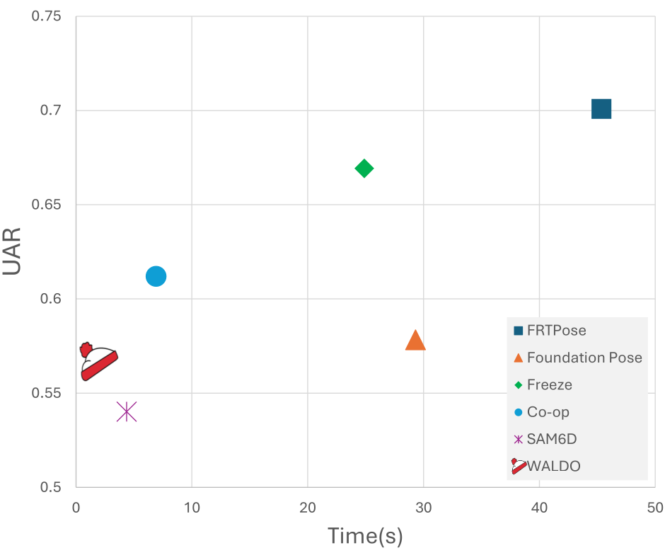
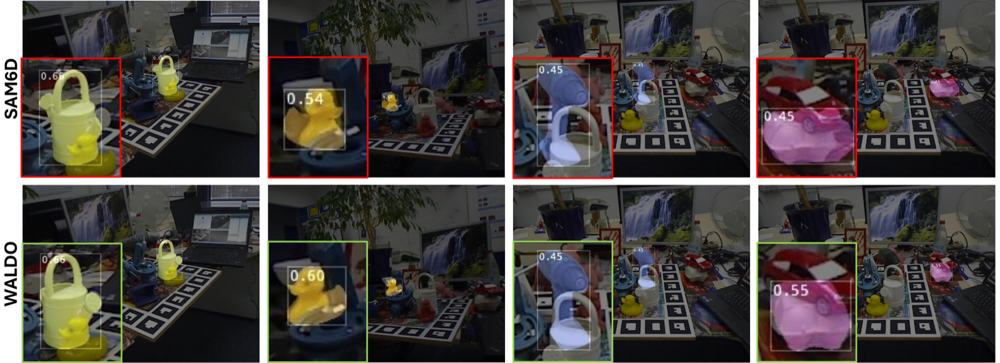

<div align="center">

# WALDO
### Where Unseen Model-based 6D Pose Estimation Meets Occlusion

**WACV 2026**

**Sajjad Pakdamansavoji**, Yintao Ma, Amir Rasouli, Tongtong Cao

Huawei Technologies Canada

[](https://arxiv.org/abs/2511.15874)
[](https://sajjadpsavoji.github.io/WALDO/)
[](https://huggingface.co/papers/2511.15874)
[](LICENSE)

</div>



---

> **Note**
> This repository is a placeholder. The paper and project page are live; **code release is in progress**.
> Watch or star the repo to be notified when it lands.

## Abstract

Accurate 6D object pose estimation is vital for robotics, augmented reality, and scene understanding. For seen objects, high accuracy is often attainable via per-object fine-tuning but generalizing to unseen objects remains a challenge. To address this problem, past arts assume access to CAD models at test time and typically follow a multi-stage pipeline to estimate poses: detect and segment the object, propose an initial pose, and then refine it. Under occlusion, however, the early-stage of such pipelines are prone to errors, which can propagate through the sequential processing, and consequently degrade the performance. To remedy this shortcoming, we propose four novel extensions to model-based 6D pose estimation methods: (i) a dynamic non-uniform dense sampling strategy that focuses computation on visible regions, reducing occlusion-induced errors; (ii) a multi-hypothesis inference mechanism that retains several confidence-ranked pose candidates, mitigating brittle single-path failures; (iii) iterative refinement to progressively improve pose accuracy; and (iv) series of occlusion-focused training augmentations that strengthen robustness and generalization. Furthermore, we propose a new weighted by visibility metric for evaluation under occlusion to minimize the bias in the existing protocols. Via extensive empirical evaluations, we show that our proposed approach achieves more than 5% improvement in accuracy on ICBIN and more than 2% on BOP dataset benchmarks, while achieving approximately 3 times faster inference.

## News

- **2026-09** &mdash; Paper released on [arXiv](https://arxiv.org/abs/2511.15874) and indexed on [Hugging Face](https://huggingface.co/papers/2511.15874).
- **2026-09** &mdash; Project page live at [sajjadpsavoji.github.io/WALDO](https://sajjadpsavoji.github.io/WALDO/).

## Getting Started

_Code coming soon._ The intended entry point:

```bash
git clone https://github.com/SajjadPSavoji/WALDO.git
cd WALDO
pip install -r requirements.txt
```

## Results



_Add a quantitative results table here._

## Citation

If you find this work useful, please cite:

```bibtex
@article{pakdamansavoji2025waldo,
  title   = {WALDO: Where Unseen Model-based 6D Pose Estimation Meets Occlusion},
  author  = {Sajjad Pakdamansavoji and Yintao Ma and Amir Rasouli and Tongtong Cao},
  journal = {arXiv preprint arXiv:2511.15874},
  year    = {2025}
}
```

## Links

- 📄 [Paper (arXiv)](https://arxiv.org/abs/2511.15874)
- 🌐 [Project page](https://sajjadpsavoji.github.io/WALDO/)
- 🤗 [Hugging Face](https://huggingface.co/papers/2511.15874)
- 👤 [Google Scholar](https://scholar.google.com/citations?user=DZzLzNwAAAAJ)
- 💼 [LinkedIn](https://www.linkedin.com/in/sajjad-pakdaman-savoji/)
- ✉️ [sj.pakdaman.edu@gmail.com](mailto:sj.pakdaman.edu@gmail.com)

## Contact

For questions about the paper, data, or code release, contact
**Sajjad Pakdamansavoji** &mdash; [sj.pakdaman.edu@gmail.com](mailto:sj.pakdaman.edu@gmail.com).

## Acknowledgements

*Corresponding author

## License

Released under the [MIT License](LICENSE).
